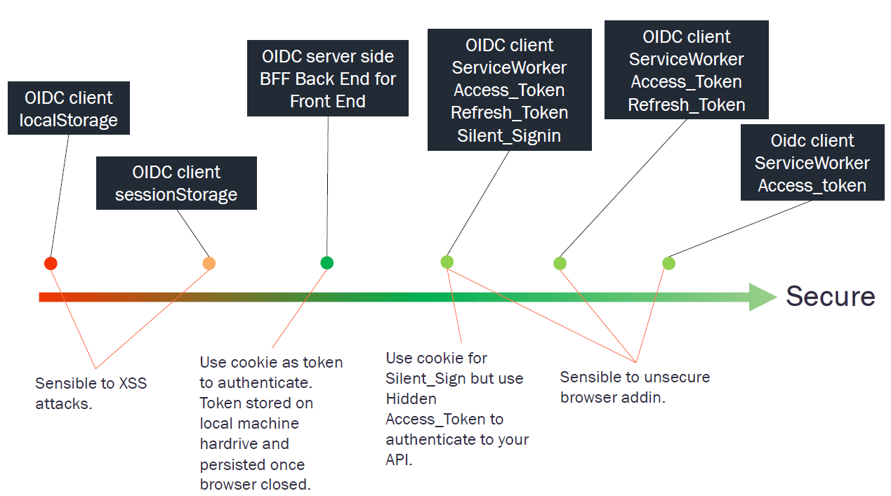
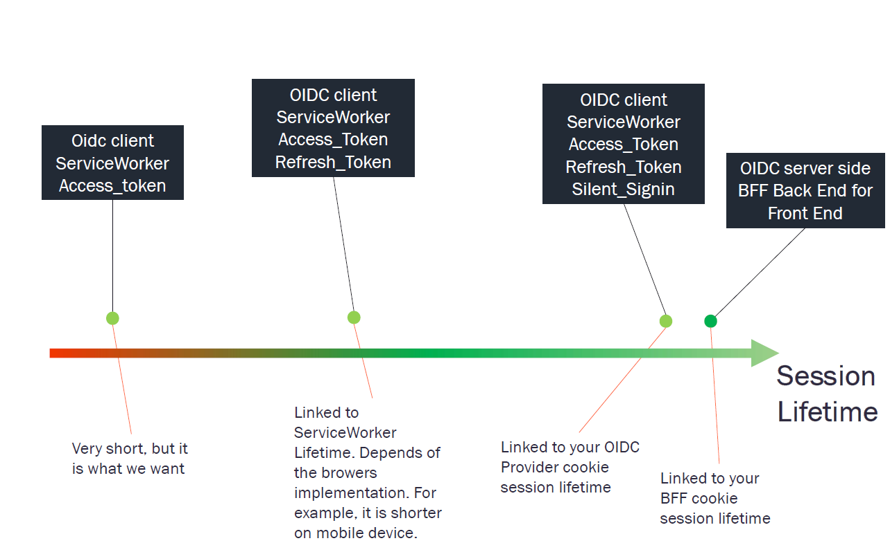

# FAQ (Frequently Asked Questions)

## Condition to make silent signing work 

Third-party cookies are blocked by default on Safari and will be blocked on all browsers soon.
Today, silent signing works on Safari only if the OIDC provider and the client application are on the same domain.

To guarantee that silent signing functions on all browsers, place your OIDC provider on the same domain as your client application.

Example domains that work:

https://oidc-provider.axa.fr
https://my-app.axa.fr

Silent signing uses cookies from your OIDC provider to restore the session and retrieve tokens.
It opens an IFrame in the background, directed to a specific page on your OIDC provider.

## Condition to make Single Logout to work

The same domain constraint for "silent signing" applies to Single Logout.  

Single Logout allows you to disconnect from multiple OIDC Client sessions in one action, even if you are connected to different applications.

## Condition to make Monitor Session to work

Same domain constraint for "silent signing" applies to "monitorSession".  

Monitor session notifies you when your session expires or when you are disconnected from your OIDC provider.

## Does Service Worker is mandatory ?

Service Worker can be disable. 
You can use classic mode without Service Worker.

Just comment "service_worker_relative_url" like bellow:

````javascript
export const configuration = {
  client_id: 'interactive.public.short',
  redirect_uri: window.location.origin + '/#/authentication/callback',
  silent_redirect_uri: window.location.origin + '/#/authentication/silent-callback',
  scope: 'openid profile email api offline_access',
  authority: 'https://demo.duendesoftware.com',
  // service_worker_relative_url: '/OidcServiceWorker.js',
  service_worker_only: false,
};
````

If your Service Worker file is already registered on your browser, your need to unregister it. For example from chrome dev tool. 

## Tokens are always refreshed in background every seconds

The @axa-fr/oidc-client automatically refreshes tokens in the background.  
It refreshes tokens before expiration to maintain valid tokens at all times.  

If your token session lifetime is too short, frequent refreshes will occur.  
Token refreshing starts 120 seconds before expiration.  

Setting a session validity longer than 3 minutes is advisable.  

By default, @axa-fr/oidc-client chooses the shorter lifetime between access_token and id_token.  
Use the "token_renew_mode" option to change this behavior.

 - **token_renew_mode**: String, // Optional, update tokens based on the selected token(s) lifetime: "access_token_or_id_token_invalid" (default), "access_token_invalid", "id_token_invalid"

## Hard-reload in browser unregister ServiceWorker
https://github.com/AxaFrance/react-oidc/issues/1098

## window.crypto.subtle is unavailable over HTTP

The library doesn't work over HTTP. Use HTTPS.
Setting up HTTPS is relatively easy, even for local development.

https://github.com/AxaFrance/react-oidc/issues/1028

## Why OIDC at Client side instead of BFF (Backend for Frontend) ?

We recommend @axa-fr/oidc-client for these reasons:

Secure by default: Uses Service Worker. Server-side OIDC can be insecure if poorly configured. Client-side reuses server-side configurations, usually set by experts.
Fine-grained scope control: Easier to tailor token scope and lifetime for specific scenarios when using client-side OIDC.
No server needed: Client-side OIDC eliminates the need for a separate authentication server, saving money.
Quick time-to-market: Start with client-side OIDC, migrate to server-side if needed. Both are compatible.

<p align="center">
    
  <br>
  @axa-fr/oidc-client is one of the securest way to Authenticate.
</p>

<p align="center">
    
  <br>
  Service Worker lifetime drawback.
</p>

<p align="center">
    
  <br>
  @axa-fr/oidc-client is the simplest and cheapest.
</p>


## Good Security Practices : does a Hacker can unregister the Service Worker and retrieve tokens via an Iframe ?

To block token retrieval via an Iframe call and prevent Service Worker unregistration, comply with these practices:

1 - Correctly configure the CSP (Content Security Policy) on the server side.  
Example: 

````bash
server: {
    headers: {
      "Content-Security-Policy": "script-src 'self';",
    },
  }
````

This blocks dynamic script injection into an iframe.  

2 - Initialize `<OidcProvider>` for **React** or the redirect callback for **oidc-client** at the start of your application script.  
Configure it before making any fetch calls to services.  
This guards against XSS attacks.
