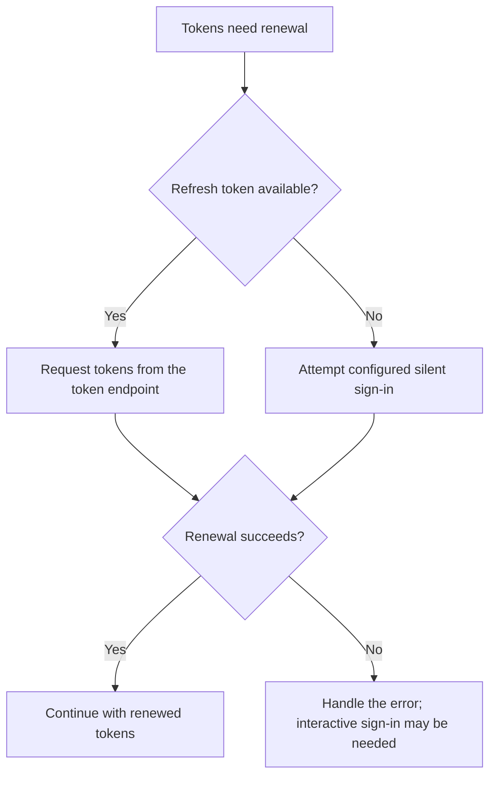
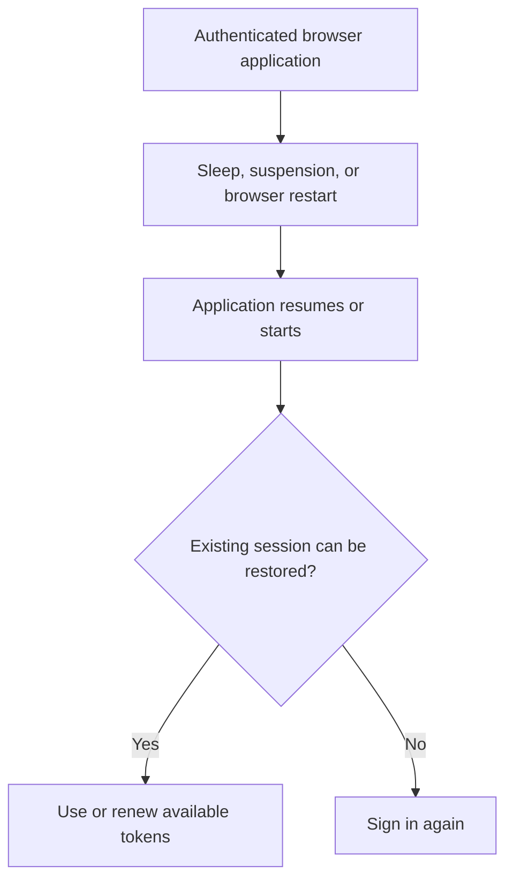
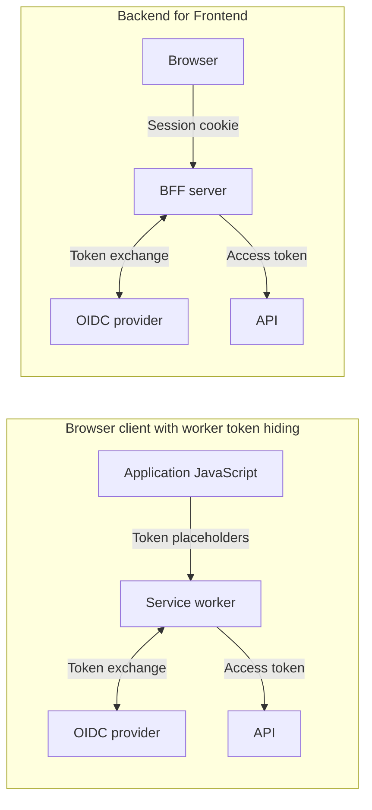

# Frequently asked questions

Start with the [React guide](./packages/react-oidc/README.md) or
[vanilla JavaScript guide](./packages/oidc-client/README.md) for installation.
These answers describe the current source; check the documentation for your
installed version when an option is unavailable. Linked issues provide context,
not guarantees that every reported problem is resolved.

## Contents

- [Do I need a service worker?](#do-i-need-a-service-worker)
- [Why is my access token a placeholder?](#why-is-my-access-token-a-placeholder)
- [Why does my API return 401, especially with multiple tabs?](#why-does-my-api-return-401-especially-with-multiple-tabs)
- [Why does login fail when two tabs sign in together?](#why-does-login-fail-when-two-tabs-sign-in-together)
- [How are tokens renewed?](#how-are-tokens-renewed)
- [Why are tokens renewed every few seconds?](#why-are-tokens-renewed-every-few-seconds)
- [Why does silent sign-in fail in some browsers?](#why-does-silent-sign-in-fail-in-some-browsers)
- [Will I stay signed in after sleep or a browser restart?](#will-i-stay-signed-in-after-sleep-or-a-browser-restart)
- [Does logout sign me out of every application?](#does-logout-sign-me-out-of-every-application)
- [What does session monitoring require?](#what-does-session-monitoring-require)
- [Why is the worker unavailable or outdated?](#why-is-the-worker-unavailable-or-outdated)
- [Can I use an existing PWA worker or a mobile WebView?](#can-i-use-an-existing-pwa-worker-or-a-mobile-webview)
- [Why is window.crypto.subtle unavailable?](#why-is-windowcryptosubtle-unavailable)
- [How do I use multiple identity providers?](#how-do-i-use-multiple-identity-providers)
- [Should I use this client or a Backend for Frontend?](#should-i-use-this-client-or-a-backend-for-frontend)
- [Does the service worker protect me from XSS?](#does-the-service-worker-protect-me-from-xss)
- [What should I include in a bug report?](#what-should-i-include-in-a-bug-report)

## Do I need a service worker?

No. Omit `service_worker_relative_url` and leave `service_worker_only: false`
(the default) to use browser storage:

```javascript
const configuration = {
  client_id: 'your-public-client',
  authority: 'https://issuer.example.com',
  redirect_uri: `${window.location.origin}/authentication/callback`,
  scope: 'openid profile',
  service_worker_only: false,
};
```

Without a worker, token storage defaults to `sessionStorage`. You can choose
`localStorage`, but both are readable by same-origin JavaScript.

Worker mode keeps access and refresh tokens in worker memory by default.
Follow the [worker setup guide](./packages/oidc-client-service-worker/README.md#getting-started);
installing the package alone does not serve or configure the worker files.
Set `service_worker_only: true` if authentication must require worker support
rather than permit fallback to browser storage.

When testing a switch away from worker mode, unregister the application's old
OIDC worker in browser developer tools and reload the page. Removing the
configuration does not unregister an already installed worker.

## Why is my access token a placeholder?

In worker mode, values such as `ACCESS_TOKEN_SECURED_BY_OIDC_SERVICE_WORKER_...`
are expected when access-token hiding is enabled. The worker holds the real
token and replaces the placeholder on matching trusted requests. Refresh tokens
are also hidden; the ID token and decoded claims can still be available to
application code.

Use `useOidcFetch()` in React or `oidcClient.fetchWithTokens(fetch)` in vanilla
JavaScript rather than trying to decode or send the placeholder yourself.
`showAccessToken: true` in the matching `OidcTrustedDomains.js` entry exposes
the access token to application JavaScript; use it only if your integration
requires that trade-off. It does not expose the refresh token.

Developer tools can show the application request and the worker's outgoing
request. Inspect which request actually failed: duplicate-looking entries do
not by themselves prove a bug, but a failed token exchange is not something to
ignore. See [#1703](https://github.com/AxaFrance/oidc-client/issues/1703).

## Why does my API return 401, especially with multiple tabs?

Check these separately:

1. Wait for authentication before calling a protected API.
2. Use the OIDC fetch wrapper and select the correct configuration name.
3. In worker mode, check that the worker controls the page and that the API URL
   matches `accessTokenDomains` for that configuration in `OidcTrustedDomains.js`.
   Follow the [trusted-domain rules](./packages/oidc-client-service-worker/README.md#trusted-domains);
   do not broaden the allowlist to arbitrary destinations.
4. Check the API's expected issuer, audience, and scopes. Attaching a token does
   not guarantee that the API will accept it.

With `allowMultiTabLogin: true` in `OidcTrustedDomains.js`, the worker uses the
tab-specific placeholder in the `Authorization` header to select the session.
A plain `fetch` or default Axios call without that marker cannot select the
tab's token.

In a React component beneath the matching `OidcProvider`, obtain the wrapper
with `useOidcFetch` imported from `@axa-fr/react-oidc`:

```javascript
const { fetch: oidcFetch } = useOidcFetch();
```

For an initialized vanilla client:

```javascript
const oidcFetch = oidcClient.fetchWithTokens(fetch);
```

Then use it after authentication:

```javascript
const response = await oidcFetch('https://api.example.com/data');
if (!response.ok) {
  throw new Error(`API request failed with status ${response.status}`);
}
const data = await response.json();
```

React also provides `withOidcFetch`. For Axios, use an integration that actually
routes requests through the OIDC fetch wrapper, or use the wrapper directly;
changing libraries alone does not supply the tab marker. Only call trusted URLs
with the wrapper: it is not itself a destination allowlist.

## Why does login fail when two tabs sign in together?

Without a worker, `storage: localStorage` shares authorization state, the PKCE
verifier, and nonce between tabs using the same configuration. Concurrent login
flows can overwrite one another and cause state-validation failures.

If you deliberately want shared token storage, merge these options into your
configuration to keep authorization-flow state isolated per tab:

```javascript
const storageOptions = {
  storage: localStorage,
  login_state_storage: sessionStorage,
};
```

This changes browser-storage behavior, not worker storage. For independent
worker-mode logins, configure `allowMultiTabLogin: true` and use the OIDC fetch
wrapper as described above.

Do not disable state or nonce validation to work around a callback failure.
For other causes, see the [errors guide](./packages/oidc-client/README.md#errors-and-events).

## How are tokens renewed?

By default, the client schedules renewal before expiry. Normal renewal uses a
refresh token when one is available; otherwise it attempts the configured
iframe-based silent-login flow.


```mermaid
flowchart TD
    Due["Tokens need renewal"] --> Refresh{"Refresh token available?"}
    Refresh -->|Yes| Endpoint["Request tokens from the token endpoint"]
    Refresh -->|No| Silent["Attempt configured silent sign-in"]
    Endpoint --> Result{"Renewal succeeds?"}
    Silent --> Result
    Result -->|Yes| Continue["Continue with renewed tokens"]
    Result -->|No| Recovery["Handle the error; interactive sign-in may be needed"]
```

Your provider controls whether it issues refresh tokens, their lifetime, and
rotation policy. Some providers require `offline_access` and additional client
settings or consent; adding that scope alone is not a guarantee.

Silent login requires separate silent-login/callback routes and a usable
provider session. See the [silent-login setup](./packages/oidc-client/README.md#silent-login).
The React provider handles these routes; vanilla applications must implement them.

For renewal only when a protected request needs it, use
`TokenAutomaticRenewMode.AutomaticOnlyWhenFetchExecuted` with the OIDC fetch
wrapper or `getValidTokenAsync()`. See [token renewal](./packages/oidc-client/README.md#token-renewal).
This is not a user-inactivity detector. If you need an idle logout, implement
activity tracking in your application and enforce appropriate session limits
at the provider/server.

Related questions: [#1368](https://github.com/AxaFrance/oidc-client/issues/1368)
and [#1070](https://github.com/AxaFrance/oidc-client/issues/1070).

## Why are tokens renewed every few seconds?

Compare your token lifetimes with `refresh_time_before_tokens_expiration_in_second`.
Its default is 120 seconds, with a random reduction of up to 39 seconds when
the configured value exceeds 60. A token whose lifetime is near or below the
renewal margin can trigger frequent renewal.

The default `token_renew_mode`, `'access_token_or_id_token_invalid'`, uses the
earlier access-token or ID-token expiry. Check both lifetimes, not just the
access token. The other modes are `'access_token_invalid'` and
`'id_token_invalid'`; choose one only if it matches your application's needs.

Adjust the renewal margin or provider-issued lifetimes together. No client-side
setting can extend a token's server-defined validity or guarantee timely
background execution.

## Why does silent sign-in fail in some browsers?

Silent sign-in loads the provider in a hidden iframe with `prompt=none`. It
depends on an existing provider session, cookies being available in that iframe,
and the provider allowing the flow and framing.

Browser privacy settings and third-party-cookie restrictions can prevent this.
Hosting the application and provider on the same site can help with cookie
restrictions, but **does not guarantee success**. For example,
`https://app.example.com` and `https://login.example.com` are different origins,
even though they are normally same-site.

Check the registered `silent_redirect_uri`, the iframe's network errors,
provider cookie settings, and CSP/frame restrictions. A provider response such
as `login_required` or `consent_required` may require interactive sign-in.
Refresh-token renewal does not use this iframe flow, although refresh tokens
can still expire or be revoked.

## Will I stay signed in after sleep or a browser restart?

Not necessarily. Browsers can suspend timers and terminate service workers;
worker tokens are held in memory, not durable token storage. Provider session
cookies may outlive the worker. If its tokens are lost, signing in again depends
on an available sign-in flow; silent sign-in also needs a usable provider session.


```mermaid
flowchart TD
    Session["Authenticated browser application"] --> Pause["Sleep, suspension, or browser restart"]
    Pause --> Resume["Application resumes or starts"]
    Resume --> Restore{"Existing session can be restored?"}
    Restore -->|Yes| Use["Use or renew available tokens"]
    Restore -->|No| SignIn["Sign in again"]
```

Network reconnection, token expiry, and cookie restrictions can all affect
recovery. Worker keep-alive requests are not a persistence guarantee.
With browser storage, `localStorage` can persist across browser sessions, but
that neither extends token validity nor makes tokens inaccessible to JavaScript.

Handle session loss with a clear sign-in action rather than an endless retry
loop. React offers `sessionLostComponent` and `onSessionLost`; vanilla clients
can subscribe to [client events](./packages/oidc-client/README.md#errors-and-events).
See [#1147](https://github.com/AxaFrance/oidc-client/issues/1147) for sleep/renewal
reports and [#1662](https://github.com/AxaFrance/oidc-client/issues/1662) for a
persistence proposal, not an implemented persistence option.

## Does logout sign me out of every application?

Not automatically. These are distinct operations:

- **Local session clearing:** `clearSessionAsync()` removes this client's local
  session without provider logout or token revocation.
- **Standard logout:** `logoutAsync()` (or React's `logout()`) attempts configured
  token revocation when the provider exposes a revocation endpoint, uses its
  end-session endpoint when available, and clears the local session. Register
  the intended post-logout URL with the provider.
- **Single logout across applications:** propagation depends on the provider,
  its logout/session protocols, and the other applications. Ending one local
  session is not proof that every application or API token is now signed out.

Check discovery metadata, provider logout requirements, and failed revocation
requests. Do not assume that serving all applications on one domain enables
single logout. See [#820](https://github.com/AxaFrance/oidc-client/issues/820)
for an example of provider-specific logout configuration.

## What does session monitoring require?

`monitor_session` defaults to `false`. When enabled, it needs the provider's
`check_session_iframe`, a `session_state`, and configured silent-login routes.
It checks for changes to the provider session; it is not a general token-expiry
or user-idle timer.

This iframe-based mechanism is also subject to browser cookie/privacy policies
and provider support. It cannot guarantee immediate logout detection across
applications. Keep API authorization and session-expiry enforcement on the server.

## Why is the worker unavailable or outdated?

Check the deployment before changing authentication logic:

1. Serve `OidcServiceWorker.js` and `OidcTrustedDomains.js` from your application's
   origin as JavaScript, not the SPA HTML fallback.
2. Confirm that `service_worker_relative_url` points to the deployed file and
   that its scope covers the application and callback pages.
3. Run the package's worker-copy command after upgrades. It replaces
   `OidcServiceWorker.js` but preserves an existing `OidcTrustedDomains.js`;
   maintain your trusted-domain entries yourself.
4. In browser developer tools, inspect the active registration and which worker
   controls the tab. Already-open tabs and cached assets can complicate updates.
5. Check secure-context support and registration errors. If you require
   `service_worker_only: true`, an unavailable worker must not be treated as a
   successful browser-storage login.

For an application under a subpath, account for the worker URL and allowed
scope. `service_worker_register` allows custom registration, but does not bypass
browser scope restrictions. See the [deployment guide](./packages/oidc-client-service-worker/README.md#deployment-and-troubleshooting),
[#1181](https://github.com/AxaFrance/oidc-client/issues/1181) (scope), and
[#1648](https://github.com/AxaFrance/oidc-client/issues/1648) (updates).

## Can I use an existing PWA worker or a mobile WebView?

Do not assume either works without integration testing.

A page has one controlling service worker at a time. An existing PWA worker and
the OIDC worker need a deliberate registration, scope, and fetch/message-handling
design. Custom registration is available, but blindly combining worker scripts
can cause conflicts. [#914](https://github.com/AxaFrance/oidc-client/issues/914)
discusses integration approaches, not a universal supported recipe.

WebView capabilities and restrictions vary by platform and host application.
`service_worker_activate` can change the library's activation decision, but
cannot add missing browser APIs. Decide whether browser-storage fallback is
acceptable, then test login, API calls, renewal, and logout in your actual
environment. See [#1389](https://github.com/AxaFrance/oidc-client/issues/1389).

## Why is window.crypto.subtle unavailable?

The Web Crypto `crypto.subtle` API and service workers require a secure context. Use HTTPS in
production. Browsers generally treat `http://localhost` as trustworthy for local
development; an HTTP LAN IP address or remote hostname is not the same exception.
Check `window.isSecureContext` and the APIs available in your browser or WebView.
Do not disable PKCE or substitute insecure cryptography.

Related report: [#1028](https://github.com/AxaFrance/oidc-client/issues/1028).

## How do I use multiple identity providers?

Use distinct configuration names rather than swapping settings under the same
name. Give each configuration its own callback URLs and, in worker mode, a
matching entry in `OidcTrustedDomains.js`.

In React, pass `configurationName` consistently to the provider and protected
components, and select the name in hooks:

```javascript
const { login, isAuthenticated } = useOidc('payments');
const { fetch: paymentsFetch } = useOidcFetch(undefined, 'payments');
```

Nesting providers does not change the hooks' default configuration name.
Follow the [named-configuration examples](./packages/react-oidc/README.md#named-configurations).
Related questions: [#1590](https://github.com/AxaFrance/oidc-client/issues/1590)
and [#1283](https://github.com/AxaFrance/oidc-client/issues/1283).

## Should I use this client or a Backend for Frontend?

Choose based on your architecture and threat model, not a claim that either is
always safer, cheaper, or simpler.


```mermaid
flowchart LR
    subgraph ClientSide["Browser client with worker token hiding"]
        App["Application JavaScript"] -->|"Token placeholders"| Worker["Service worker"]
        Worker <-->|"Token exchange"| ProviderA["OIDC provider"]
        Worker -->|"Access token"| APIA["API"]
    end
    subgraph ServerSide["Backend for Frontend"]
        Browser["Browser"] -->|"Session cookie"| BFF["BFF server"]
        BFF <-->|"Token exchange"| ProviderB["OIDC provider"]
        BFF -->|"Access token"| APIB["API"]
    end
```

This browser client can be used with a statically hosted application, without
adding a dedicated authentication backend. You still need an identity provider,
protected APIs, and appropriate CORS configuration. With worker token hiding
enabled, access and refresh tokens remain in the browser's worker context;
without the worker, they are accessible to application JavaScript.

A BFF keeps OAuth tokens on the server and typically gives the browser a
session cookie. It requires backend hosting, session management, secure cookie
configuration, and CSRF defenses. XSS can still cause authenticated actions in
either architecture. This library does not implement a BFF or server-side access
control.

## Does the service worker protect me from XSS?

It reduces direct access to hidden tokens, but **does not prevent XSS or CSRF**.
Malicious code running in your application can still make authenticated
requests. Initializing `OidcProvider` early is not an XSS defense, and a CSP
such as `script-src 'self'` does not guarantee that worker unregistration or
iframe-based attacks are impossible.

Use a restrictive CSP suited to your deployment, safe rendering and input
handling, reviewed dependencies, and narrowly scoped trusted destinations.
Never embed a client secret in browser code. Do not render or log tokens.
Your APIs must validate tokens and enforce authorization independently of
client-side route guards.

## What should I include in a bug report?

Include the package versions, browser/OS (and WebView host if applicable),
whether a worker is enabled, relevant configuration names, sanitized
configuration, reproduction steps, and expected versus actual behavior.
For worker problems, include registration/scope information and whether the
problem reproduces after a fresh registration in a test environment.

Use React's `onEvent` or the vanilla client's `subscribeEvents` to identify the
failing phase. Record safe error codes and HTTP statuses, not complete event
payloads. Remove tokens, authorization headers, cookies, authorization codes,
PKCE verifiers, and personal data from screenshots, logs, or network exports
before posting an [issue](https://github.com/AxaFrance/oidc-client/issues).
