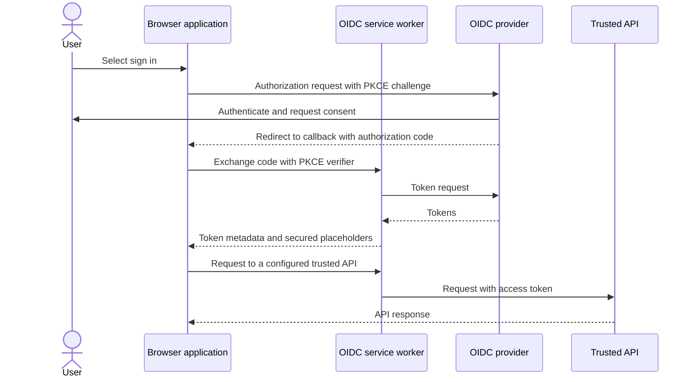

# OIDC Client

[](https://github.com/AxaFrance/oidc-client/actions/workflows/npm-publish.yml)
[](https://www.npmjs.com/package/@axa-fr/oidc-client)
[](https://www.npmjs.com/package/@axa-fr/react-oidc)

Add OpenID Connect (OIDC) sign-in to browser applications using the OAuth 2.0
Authorization Code flow with PKCE. Use the framework-independent client directly,
or the React components and hooks.

- [Choose a package](#choose-a-package)
- [Getting started](#getting-started)
- [How it works](#how-it-works)
- [Security and deployment](#security-and-deployment)
- [Run the demos](#run-the-demos)
- [FAQ](#faq)
- [Migrations](#migrations)
- [Contribute](#contribute)

## Choose a package

| Package                              | Use it for                                                                            | Documentation                                                                                                                                     |
| ------------------------------------ | ------------------------------------------------------------------------------------- | ------------------------------------------------------------------------------------------------------------------------------------------------- |
| `@axa-fr/oidc-client`                | Browser applications using any JavaScript framework, or no framework                  | [Installation, configuration, and API](./packages/oidc-client/README.md)                                                                          |
| `@axa-fr/react-oidc`                 | React providers, protected components, authentication hooks, and authenticated fetch  | [React quick start and recipes](./packages/react-oidc/README.md)                                                                                  |
| `@axa-fr/oidc-client-service-worker` | The worker used by both clients to isolate tokens and attach them to trusted requests | [Setup and deployment](./packages/oidc-client-service-worker/README.md) · [Protocol reference](./packages/oidc-client-service-worker/PROTOCOL.md) |

Most applications install only one of the first two packages. The service worker
is included as a dependency; it does not replace the browser client.

Features include automatic token renewal, named configurations for multiple
providers or scopes, optional service-worker token isolation, and support for
[DPoP](https://www.rfc-editor.org/rfc/rfc9449.html) and
[Pushed Authorization Requests (PAR)](./packages/oidc-client/README.md#pushed-authorization-requests-par)
when supported by your authorization server.

## Getting started

1. Register a **public browser client** with your OIDC provider. Enable the
   Authorization Code flow with PKCE and register your exact callback and
   post-logout URLs. Do not put a client secret in browser code.
2. Install the package for your application:

   ```sh
   # Framework-independent applications
   npm install @axa-fr/oidc-client

   # React applications — choose this instead
   npm install @axa-fr/react-oidc
   ```

3. Follow the [vanilla JavaScript quick start](./packages/oidc-client/README.md#getting-started)
   or the [React quick start](./packages/react-oidc/README.md#getting-started).
   Set your provider's `authority`, `client_id`, `redirect_uri`, and `scope`.
4. Choose whether to use the service worker. Its setup requires serving
   `OidcServiceWorker.js` and configuring `OidcTrustedDomains.js`; installing the
   npm package alone is not sufficient.

Your provider must allow requests from your application origin to the endpoints
the browser calls, including the token endpoint. Request `offline_access` only
when your provider and client registration support refresh tokens.

## How it works

The client creates a PKCE challenge, redirects the browser to the provider, and
exchanges the returned authorization code for tokens. In service-worker mode,
the worker intercepts the token exchange and authenticated API requests:



With the default token-hiding settings, the real access and refresh tokens stay
in the worker; the application receives placeholders instead. Without the worker,
the client manages tokens in browser storage and the authenticated fetch wrapper
adds the access token to API requests.

## Security and deployment

- **Service-worker isolation is not an XSS or CSRF prevention mechanism.** Malicious
  code running in the application can still make requests on the user's behalf.
  Apply a restrictive Content Security Policy and normal input/output protections.
- Use HTTPS in production. Service workers require a secure context; localhost
  is suitable for development.
- Restrict `OidcTrustedDomains.js` to the provider endpoints and API URLs that
  should receive tokens. Review these rules whenever you add an API.
- Keep `OidcServiceWorker.js` aligned with the installed library version using the
  copy command and `postinstall` instructions in the package guides.
- Decide explicitly whether to permit fallback to browser storage or require the
  worker with `service_worker_only: true`. Browser storage is accessible to
  same-origin JavaScript.
- Configure your host to serve the application at callback URLs. If you enable
  silent sign-in, use a separate silent callback URL and account for browser
  restrictions on third-party cookies.
- Protect APIs on the server: a client-side route guard is not an authorization
  boundary.

See the [FAQ](./FAQ.md) for deployment and security considerations.

## Run the demos

Try the hosted [React demo](https://black-rock-0dc6b0d03.1.azurestaticapps.net/) or
[vanilla JavaScript demo](https://icy-glacier-004ab4303.2.azurestaticapps.net/).
These are learning environments, not production security templates.

To run locally, use a Node.js version supported by the root
[`package.json`](./package.json) and its pinned pnpm version. From the repository
root:

```sh
corepack enable
pnpm install --frozen-lockfile
pnpm build
```

Then choose one command, also from the repository root:

| Demo                      | Command                                      | Guide                                                                                                          |
| ------------------------- | -------------------------------------------- | -------------------------------------------------------------------------------------------------------------- |
| Vanilla JavaScript (Vite) | `pnpm --dir examples/oidc-client-demo start` | [Callbacks, session restoration, and token isolation](./examples/oidc-client-demo/README.md)                   |
| React (Vite)              | `pnpm --dir examples/react-oidc-demo start`  | [Hooks, protected components, API requests, and multiple configurations](./examples/react-oidc-demo/README.md) |
| Next.js (Pages Router)    | `pnpm --dir examples/nextjs-demo dev`        | [Browser authentication and custom history integration](./examples/nextjs-demo/README.md)                      |

For Vite, open the URL printed in the terminal (normally `http://localhost:5173`;
another port is used if it is busy). The Next.js demo uses `http://localhost:3001`.
Register the actual origin and callback URLs with your provider before testing
sign-in. The demos use an external provider whose availability and registrations
are outside this repository's control.

## FAQ

Start with the [FAQ](./FAQ.md) for common integration questions, then consult the
package guides for configuration and error handling. To report a problem, open an
[issue](https://github.com/AxaFrance/oidc-client/issues) with a minimal reproduction,
browser and package versions, and sanitized configuration. Never include tokens
or credentials.

## Migrations

- [v3 to v4](./MIGRATION_GUIDE_V3_TO_V4.md)
- [v3 to v5](./MIGRATION_GUIDE_V3_TO_V5.md)
- [v4 to v5](./MIGRATION_GUIDE_V4_TO_V5.md)
- [v5 to v6](./MIGRATION_GUIDE_V5_TO_V6.md)
- [v6 to v7](./MIGRATION_GUIDE_V6_TO_V7.md)

## Contribute

Read the [contribution guide](./CONTRIBUTING.md) and
[code of conduct](./CODE_OF_CONDUCT.md). The workspace contains the client, React
bindings, service worker, and demo applications.

```sh
pnpm lint-fix
pnpm lint
pnpm test:ci
pnpm build
```
