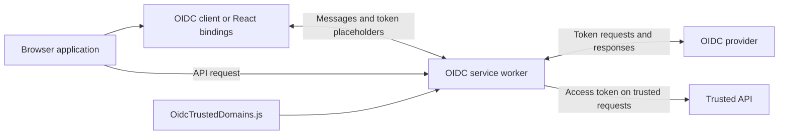

# @axa-fr/oidc-client-service-worker

The service worker used by [`@axa-fr/oidc-client`](../oidc-client/README.md) and
[`@axa-fr/react-oidc`](../react-oidc/README.md). It intercepts OIDC token responses,
keeps access and refresh tokens in worker memory by default, and adds access
tokens to requests that match your trusted-domain configuration.

Most applications should install one of the client packages rather than use this
package directly. The clients handle worker registration and communication.

- [How it works](#how-it-works)
- [Getting started](#getting-started)
- [Trusted domains](#trusted-domains)
- [Deployment and troubleshooting](#deployment-and-troubleshooting)
- [Protocol reference](#protocol-reference)

## How it works



The application can use token metadata without receiving the real access or
refresh token. `showAccessToken: true` explicitly exposes the access token to
application JavaScript while keeping the refresh token in the worker.

> [!IMPORTANT]
> Token isolation does not prevent XSS or CSRF. Injected code can still make
> authenticated requests from the application. Use a restrictive Content Security
> Policy, prevent script injection, and enforce authorization on your APIs.

## Getting started

1. Install and configure the [vanilla client](../oidc-client/README.md#getting-started)
   or [React bindings](../react-oidc/README.md#getting-started).
2. Create your application's public-assets directory if it does not exist, then
   run the copy command for the client you installed:

   ```sh
   # Vanilla client
   node ./node_modules/@axa-fr/oidc-client/bin/copy-service-worker-files.mjs public

   # React — use this instead
   node ./node_modules/@axa-fr/react-oidc/bin/copy-service-worker-files.mjs public
   ```

   Replace `public` if your framework serves static files from another directory.
   The command overwrites `OidcServiceWorker.js` but preserves an existing
   `OidcTrustedDomains.js`.

3. Replace the sample entries in `public/OidcTrustedDomains.js` with your provider
   and API URLs, as described below.
4. Add these fields to your OIDC client configuration:

   ```js
   const configuration = {
     ...oidcConfiguration,
     service_worker_relative_url: '/OidcServiceWorker.js',
     service_worker_only: true,
   };
   ```

   With `service_worker_only: true`, authentication requires worker support.
   Set it to `false` only if you accept fallback to JavaScript-accessible browser
   storage when the worker is unavailable.

5. Add the appropriate copy command to your application's `postinstall` script.
   For example, for React:

   ```json
   {
     "scripts": {
       "postinstall": "node ./node_modules/@axa-fr/react-oidc/bin/copy-service-worker-files.mjs public"
     }
   }
   ```

   Merge this with existing installation steps rather than replacing them.
   Deploy the copied worker with every client upgrade.

## Trusted domains

Keep provider endpoints and API destinations separate:

```js
const trustedDomains = {
  default: {
    oidcDomains: [/^https:\/\/identity\.example\.com(?:\/|$)/],
    accessTokenDomains: [/^https:\/\/api\.example\.com(?:\/|$)/],
  },
};
```

`default` is the default client configuration name. Add a matching entry for
every named client or `OidcProvider`. These rules use regular-expression matching,
including when rules are strings. Anchor patterns, escape hostname dots, and
include a host or path boundary so that lookalike URLs do not match.
Include the actual OIDC endpoint origins
if your provider serves discovery, tokens, or user information from different
hosts. Allow only the API destinations that should receive this configuration's
access token; do not copy the demo allowlist into production.

Use `oidcClient.fetchWithTokens(fetch)` in vanilla applications or `useOidcFetch()`
in React. In particular, `allowMultiTabLogin: true` **requires** the OIDC fetch
wrapper: its placeholder identifies the tab whose token the worker must inject.
A plain `fetch` cannot supply that information.

See the [client's service-worker guide](../oidc-client/README.md#service-worker-support)
for additional options, including DPoP, access-token visibility, and request
handling.

## Deployment and troubleshooting

- Serve both JavaScript files from your application's origin over HTTPS
  (localhost is supported for development).
- The worker must control the pages that use it. Serving it at the origin root
  is the simplest setup; account for worker scope when hosting under a subpath.
- Serve the files as JavaScript, not the HTML fallback used for SPA routes.
  Check the Network and Application panels in browser developer tools if
  registration fails.
- Keep the worker version aligned with the client. Edit the trusted-domain file,
  not the generated `OidcServiceWorker.js`.
- If API requests return 401, check the active configuration name, the matching
  `accessTokenDomains` entry, and whether you are using the OIDC fetch wrapper.
  The API must also accept the token's issuer, audience, and scopes.
- After changing worker assets, check which worker version controls your page;
  an already-open tab may still be controlled by an older worker.

The [FAQ](../../FAQ.md) covers broader security and integration questions.

## Protocol reference

Most applications do not need to send worker messages directly. For custom
integrations, [`PROTOCOL.md`](./PROTOCOL.md) describes the versioned message
envelope, payloads, token placeholders, storage keys, and compatibility guarantees.

Protocol constants and types are exported from
`@axa-fr/oidc-client-service-worker/protocol` and re-exported by
`@axa-fr/oidc-client`.

[Back to the project overview](../../README.md)
