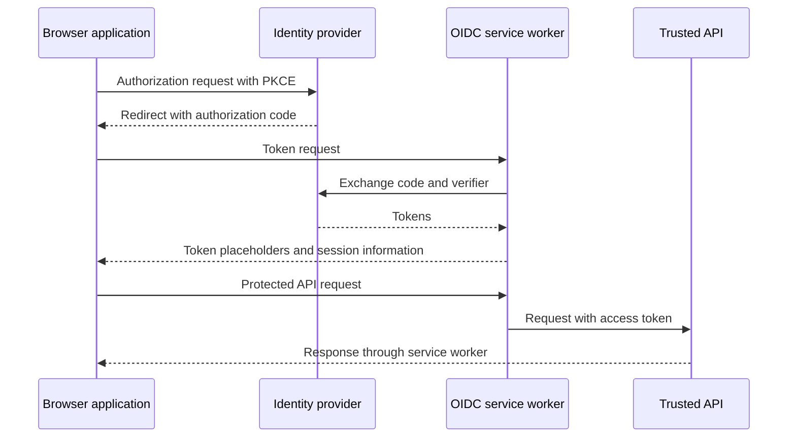

# @axa-fr/oidc-client

A framework-independent OpenID Connect (OIDC) client for browser applications, written in TypeScript. It supports Authorization Code Flow with PKCE, session restoration, token renewal, multiple named configurations, optional service-worker token isolation, Pushed Authorization Requests (PAR), and DPoP.

For React applications, use [`@axa-fr/react-oidc`](../react-oidc/README.md).

- [Quick start](#quick-start)
- [Service worker](#service-worker)
- [Configuration](#configuration)
- [Token renewal](#token-renewal)
- [Pushed Authorization Requests (PAR)](#pushed-authorization-requests-par)
- [DPoP](#dpop)
- [API](#api)
- [Errors and events](#errors-and-events)
- [Named configurations and routing](#named-configurations-and-routing)
- [Service-worker protocol](#service-worker-protocol)
- [Examples and further reading](#examples-and-further-reading)

<a id="getting-started"></a>

## Quick start

```sh
npm install @axa-fr/oidc-client
```

Register a **public browser client** with your identity provider:

1. Enable Authorization Code Flow with PKCE.
2. Register your application's exact callback URL, such as `https://app.example.com/authentication/callback`, and its post-logout URL.
3. Allow your application's origin to call the provider's browser-accessible endpoints through CORS.
4. Choose the scopes your application needs. Request `offline_access` only if your provider uses it to issue refresh tokens.

Never put a client secret in browser code. Replace the example issuer and client ID below with your own values. Configure your web server to serve the application on the callback route as well as `/`.

Add these elements to your page:

```html
<p id="session-status" role="status">Loading session…</p>
<button id="login" type="button" hidden>Sign in</button>
<button id="logout" type="button" hidden>Sign out</button>
```

Run this module when those elements are available, including on the callback route:

```javascript
import { OidcClient } from '@axa-fr/oidc-client';

const configuration = {
  client_id: 'your-public-client',
  authority: 'https://issuer.example.com',
  redirect_uri: `${window.location.origin}/authentication/callback`,
  scope: 'openid profile',
};

const oidcClient = OidcClient.getOrCreate(() => fetch)(configuration);
const status = document.getElementById('session-status');
const loginButton = document.getElementById('login');
const logoutButton = document.getElementById('logout');

function showError() {
  status.textContent = 'Authentication could not be completed. Please try again.';
}

loginButton.addEventListener('click', () => {
  oidcClient.loginAsync('/').catch(showError);
});
logoutButton.addEventListener('click', () => {
  oidcClient.logoutAsync('/').catch(showError);
});

async function start() {
  if (window.location.pathname === new URL(configuration.redirect_uri).pathname) {
    const { callbackPath } = await oidcClient.loginCallbackAsync();
    window.history.replaceState(null, '', callbackPath || '/');
  } else {
    await oidcClient.tryKeepExistingSessionAsync();
  }

  const isAuthenticated = oidcClient.tokens != null;
  status.textContent = isAuthenticated ? 'Signed in' : 'Not signed in';
  loginButton.hidden = isAuthenticated;
  logoutButton.hidden = !isAuthenticated;
}

start().catch(showError);
```

This minimal example uses browser storage, not a service worker. Read the next section before choosing a token-storage strategy for production.

### Call a protected API

Use the client's fetch wrapper after authentication:

```javascript
const oidcFetch = oidcClient.fetchWithTokens(fetch);
const response = await oidcFetch('https://api.example.com/profile');

if (!response.ok) {
  throw new Error(`API request failed with status ${response.status}`);
}
const profile = await response.json();
```

The wrapper attaches an access token, or a token placeholder when the service worker hides it, and integrates with token renewal. Only use it for API URLs you trust: the wrapper itself is not a destination allowlist. HTTP error responses still need an explicit `response.ok` check.

<a id="service-worker-support"></a>

## Service worker

The optional service worker can keep access and refresh tokens outside the application's JavaScript context and attach access tokens to configured API requests. It does **not** prevent XSS: injected code can still act through your application and make requests. Continue to use normal XSS defenses, carefully restrict trusted destinations, and avoid rendering or logging raw tokens.



The diagram shows worker mode with access-token hiding enabled. The ID token and decoded claims may still be available to application code.

### Install and update the worker

```sh
node ./node_modules/@axa-fr/oidc-client/bin/copy-service-worker-files.mjs public
```

Replace `public` with your application's static-assets directory, and ensure that directory exists before running the command. This creates or updates `OidcServiceWorker.js` and creates `OidcTrustedDomains.js` if it does not already exist. Keep the worker version aligned with the client package; for example, merge this script into your `package.json`:

```json
{
  "scripts": {
    "postinstall": "node ./node_modules/@axa-fr/oidc-client/bin/copy-service-worker-files.mjs public"
  }
}
```

Edit `public/OidcTrustedDomains.js`, not the generated worker:

```javascript
const trustedDomains = {
  default: {
    oidcDomains: [/^https:\/\/issuer\.example\.com(?:\/|$)/],
    accessTokenDomains: [/^https:\/\/api\.example\.com\//],
  },
};
```

Include the provider's endpoint origins if they differ from its issuer URL. Keep access-token destinations as narrow as possible; patterns can include paths. String entries are interpreted as regular-expression prefixes, not exact origin matches. The example uses anchored regular expressions with escaped dots and hostname boundaries to avoid unintended matches. The `default` key must match the OIDC configuration name.

Add these options to your client configuration:

```javascript
service_worker_relative_url: '/OidcServiceWorker.js',
service_worker_only: true,
```

Serve the worker from a URL whose scope covers your application, using HTTPS (or localhost for development). With `service_worker_only: true`, login requires an available service worker. With `false` (the default), the client can fall back to browser storage when worker mode is unavailable. Choose that fallback deliberately.

### Trusted-domain options

These options belong in each named entry in `OidcTrustedDomains.js`, not in `OidcConfiguration`.

| Option                                                    | Purpose                                                                                                                                                            |
| --------------------------------------------------------- | ------------------------------------------------------------------------------------------------------------------------------------------------------------------ |
| `oidcDomains`                                             | Provider URLs the worker is allowed to handle.                                                                                                                     |
| `accessTokenDomains`                                      | API URLs to which the worker may attach an access token.                                                                                                           |
| `domains`                                                 | Shorthand for a shared provider/API destination list; separate lists give finer control.                                                                           |
| `showAccessToken`                                         | Defaults to `false`. Set to `true` only when an integration requires the real access token in application JavaScript; refresh tokens remain hidden in worker mode. |
| `allowMultiTabLogin`                                      | Isolates login state, nonce, and PKCE verifier by tab. Requires the OIDC fetch wrapper for protected API requests; see below.                                      |
| `convertAllRequestsToCorsExceptNavigate`                  | Defaults to `false`; optionally changes non-navigation requests to CORS mode.                                                                                      |
| `setAccessTokenToNavigateRequests`                        | Defaults to `true`; controls token attachment to matching navigation requests.                                                                                     |
| `bypassAllNonOidcRequests`                                | Defaults to `false`. When enabled for all initialized worker configurations, requests outside OIDC and access-token destinations are left to the browser.          |
| `demonstratingProofOfPossession`                          | Enables worker-side DPoP for this configuration.                                                                                                                   |
| `demonstratingProofOfPossessionOnlyWhenDpopHeaderPresent` | Defaults to `true` when worker DPoP is enabled. Requires a DPoP header before worker-side DPoP injection; set to `false` to remove that condition.                 |
| `demonstratingProofOfPossessionConfiguration`             | Overrides the worker's cryptographic algorithms; see [DPoP](#dpop).                                                                                                |

With `allowMultiTabLogin: true`, **use `oidcClient.fetchWithTokens(fetch)` for protected API requests**. Its tab-specific token placeholder tells the worker which session to use. Plain `fetch` or a default Axios request does not provide that marker, so automatic token attachment cannot select the tab's token and requests may receive HTTP 401. Use the OIDC fetch directly, or an integration that actually routes requests through it.

## Configuration

The public [`OidcConfiguration` type](./src/types.ts) is the complete reference. Required fields are `client_id`, `authority`, `redirect_uri`, and `scope`.

| Option                                            | Default / behavior                                                                                                                                                                                           |
| ------------------------------------------------- | ------------------------------------------------------------------------------------------------------------------------------------------------------------------------------------------------------------ |
| `authority_configuration`                         | Supply endpoint metadata instead of discovery. See `AuthorityConfiguration` in the type reference, including PAR metadata.                                                                                   |
| `storage`                                         | `sessionStorage` when worker storage is not used. `localStorage` persists across tabs and browser sessions, but both are accessible to application JavaScript.                                               |
| `login_state_storage`                             | Defaults to `storage`; separates authorization state, verifier, nonce, and login parameters from token storage. If tokens use `localStorage`, consider `sessionStorage` here to avoid cross-tab login races. |
| `silent_redirect_uri`                             | Enables the iframe-based silent-login flow. Must differ from `redirect_uri`; register it with the provider.                                                                                                  |
| `silent_login_uri`                                | Page that starts silent login; derived from `silent_redirect_uri` if omitted.                                                                                                                                |
| `silent_login_timeout`                            | `12000` milliseconds.                                                                                                                                                                                        |
| `refresh_time_before_tokens_expiration_in_second` | `120` seconds; the client applies random jitter when this setting is greater than 60.                                                                                                                        |
| `token_renew_mode`                                | `'access_token_or_id_token_invalid'`; alternatives are `'access_token_invalid'` and `'id_token_invalid'`.                                                                                                    |
| `token_automatic_renew_mode`                      | `TokenAutomaticRenewMode.AutomaticBeforeTokenExpiration`; see [token renewal](#token-renewal).                                                                                                               |
| `token_request_timeout`                           | Token-request timeout in milliseconds.                                                                                                                                                                       |
| `extras`                                          | Additional authorization-request parameters, such as `{ prompt: 'consent' }`.                                                                                                                                |
| `token_request_extras`                            | Additional token-request parameters. Never use this to embed a browser client secret.                                                                                                                        |
| `par`, `par_request_timeout`                      | `'disabled'` and `10000` milliseconds; see [PAR](#pushed-authorization-requests-par).                                                                                                                        |
| `authority_time_cache_wellknowurl_in_second`      | Discovery-cache lifetime; defaults to one hour.                                                                                                                                                              |
| `authority_timeout_wellknowurl_in_millisecond`    | Discovery timeout; defaults to `10000` milliseconds.                                                                                                                                                         |
| `monitor_session`                                 | `false`; enables OIDC session monitoring when supported by the provider and browser.                                                                                                                         |
| `logout_tokens_to_invalidate`                     | `['access_token', 'refresh_token']`; token types to revoke during standard logout.                                                                                                                           |
| `preload_user_info`                               | `false`; fetch user information during login/session restoration instead of waiting for a consumer.                                                                                                          |
| `demonstrating_proof_of_possession`               | `false`; see [DPoP](#dpop).                                                                                                                                                                                  |
| `demonstrating_proof_of_possession_configuration` | Cryptographic settings for client-side DPoP.                                                                                                                                                                 |
| `service_worker_relative_url`                     | URL of the worker; omit to disable worker mode.                                                                                                                                                              |
| `service_worker_only`                             | `false`; disallows browser-storage fallback when `true`.                                                                                                                                                     |
| `service_worker_keep_alive_path`                  | `'/'`; path used by worker keep-alive requests.                                                                                                                                                              |
| `service_worker_activate`                         | Function to override the default browser-based activation decision.                                                                                                                                          |
| `service_worker_register`                         | Custom `(url) => Promise<ServiceWorkerRegistration>` registration function.                                                                                                                                  |
| `loading_timeout_ms`                              | Used by the React provider's loading watchdog; see the [React guide](../react-oidc/README.md#custom-components-and-provider-options).                                                                        |

### Silent login

Silent login uses an iframe and the provider's existing session. It depends on provider support and browser cookie/privacy policies; it is not a guaranteed replacement for refresh tokens.

For a vanilla application, implement both the `silent_login_uri` page and the `silent_redirect_uri` callback page. The login page starts `loginAsync` with `isSilentSignin: true` (the third argument); the callback page calls `silentLoginCallbackAsync()`. Keep these routes separate from the interactive callback. The React provider handles these routes for you; its [silent-login route implementation](../react-oidc/src/core/default-component/SilentLogin.component.tsx) is also a reference for forwarding silent-login parameters.

## Token renewal

By default, the client schedules renewal before tokens expire. It uses a refresh token when available, or the configured silent-login flow. Refresh-token issuance and lifetime remain provider decisions.

For renewal only when an API request needs it:

```typescript
import { TokenAutomaticRenewMode } from '@axa-fr/oidc-client';

const renewalOptions = {
  token_automatic_renew_mode: TokenAutomaticRenewMode.AutomaticOnlyWhenFetchExecuted,
};
```

Merge this option into your configuration and use `fetchWithTokens(fetch)` or `getValidTokenAsync()` before protected requests. Plain fetch does not trigger this renewal mode.

- `renewTokensAsync(extras?, scope?)` requests renewal and preserves the non-throwing behavior for terminal OIDC failures.
- `renewTokensOrThrowAsync(extras?, scope?)` returns tokens or rejects, for callers that need explicit failure handling.
- Automatic renewal reports failures through [events](#errors-and-events).

## Pushed Authorization Requests (PAR)

[PAR (RFC 9126)](https://www.rfc-editor.org/rfc/rfc9126.html) sends authorization parameters to the provider before navigating the browser.

| `par` mode             | Behavior                                                                                                                                              |
| ---------------------- | ----------------------------------------------------------------------------------------------------------------------------------------------------- |
| `'disabled'` (default) | Uses the normal front-channel request and ignores PAR metadata.                                                                                       |
| `'auto'`               | Uses a discovered or configured `pushed_authorization_request_endpoint`. Falls back only when no endpoint exists and the server does not require PAR. |
| `'required'`           | Requires a PAR endpoint; fails before navigation if none is available.                                                                                |

If metadata says `require_pushed_authorization_requests: true`, `'auto'` also fails when the endpoint is missing. Set `par_request_timeout` to adjust the default 10-second timeout.

Once PAR is selected, the client sends authorization parameters (including state, nonce, PKCE, and login extras) as `application/x-www-form-urlencoded` data. The subsequent browser redirect carries `client_id` and the returned `request_uri`. An endpoint failure or invalid response **never silently downgrades** to the front-channel flow.

Failures use `PushedAuthorizationRequestError`, with codes from `PushedAuthorizationRequestErrorCode`: `ENDPOINT_UNAVAILABLE`, `REQUEST_FAILED`, or `INVALID_RESPONSE`. Use `isPushedAuthorizationRequestError(error)` and inspect `code`, plus `status`, `oauthError`, and `oauthErrorDescription` when available.

The PAR endpoint must allow CORS from your application and accept public clients without a client secret. If discovery is unavailable, configure `pushed_authorization_request_endpoint` and, where applicable, `require_pushed_authorization_requests` in `authority_configuration`.

## DPoP

[Demonstrating Proof of Possession (RFC 9449)](https://www.rfc-editor.org/rfc/rfc9449.html) binds supported tokens to a key and uses signed proofs for requests. It requires support from the authorization server and resource server. It reduces the usefulness of a stolen token without its key; it does not make an application immune to XSS.

For client-side DPoP, set `demonstrating_proof_of_possession: true` in the OIDC configuration and opt in for protected requests:

```javascript
const dpopFetch = oidcClient.fetchWithTokens(fetch, true);
const response = await dpopFetch('https://api.example.com/profile', { method: 'GET' });
```

Similarly, pass `true` as the second argument to `userInfoAsync(false, true)` if the user-info endpoint requires DPoP. For worker-side DPoP, configure `demonstratingProofOfPossession` in the matching trusted-domain entry and review `demonstratingProofOfPossessionOnlyWhenDpopHeaderPresent`.

The default cryptographic configuration uses ECDSA P-256, SHA-256, and the `ES256` JWT algorithm. Override algorithms through `demonstrating_proof_of_possession_configuration` (client) or `demonstratingProofOfPossessionConfiguration` (worker). See [`DemonstratingProofOfPossessionConfiguration`](./src/types.ts).

## API

See [`OidcClient`](./src/oidcClient.ts) for full TypeScript signatures.

| API                                                                                | Use                                                                                                                           |
| ---------------------------------------------------------------------------------- | ----------------------------------------------------------------------------------------------------------------------------- |
| `OidcClient.getOrCreate(getFetch, location?)(configuration, name?)`                | Create or reuse a named client. Pass `() => fetch` for the browser fetch implementation; the default name is `'default'`.     |
| `OidcClient.get(name?)`                                                            | Retrieve an existing client, or `null` if it has not been initialized.                                                        |
| `OidcClient.getOrThrow(name?)`                                                     | Retrieve an existing client, or throw on missing initialization.                                                              |
| `tryKeepExistingSessionAsync()`                                                    | Restore an existing session; returns whether it was kept.                                                                     |
| `loginAsync(callbackPath?, extras?, isSilentSignin?, scope?, silentLoginOnly?)`    | Start authentication. `callbackPath` is the application destination after the callback, not the registered `redirect_uri`.    |
| `loginCallbackAsync()`                                                             | Complete interactive authentication, start automatic renewal, and return `{ callbackPath }`.                                  |
| `silentLoginCallbackAsync()`                                                       | Complete the iframe silent-login callback.                                                                                    |
| `logoutAsync(callbackPathOrUrl?, extras?)`                                         | Clear the session, revoke configured tokens, and use the provider's logout endpoint when available.                           |
| `clearSessionAsync()`                                                              | Clear the local session without provider logout or token revocation.                                                          |
| `isLoggingOut`                                                                     | Indicates logout is in progress; avoid starting a competing login flow.                                                       |
| `renewTokensAsync(extras?, scope?)`                                                | Request token renewal.                                                                                                        |
| `renewTokensOrThrowAsync(extras?, scope?)`                                         | Request renewal with a rejected promise on failure.                                                                           |
| `getValidTokenAsync(waitMs?, numberWait?)`                                         | Wait for usable tokens; also supports on-demand renewal.                                                                      |
| `fetchWithTokens(fetch, demonstratingProofOfPossession?)`                          | Wrap fetch for protected API requests.                                                                                        |
| `userInfoAsync<T>(noCache?, demonstratingProofOfPossession?)`                      | Load user information, optionally bypassing the cache.                                                                        |
| `userInfo<T>()`                                                                    | Read cached user information.                                                                                                 |
| `tokens`, `configuration`                                                          | Inspect current session data and effective configuration. Tokens can contain worker placeholders; do not display or log them. |
| `subscribeEvents(handler)`                                                         | Subscribe to `(eventName, data)` and receive a subscription ID.                                                               |
| `removeEventSubscription(id)`                                                      | Remove an event subscription.                                                                                                 |
| `OidcClient.eventNames`                                                            | Discover supported event names.                                                                                               |
| `publishEvent(name, data)`                                                         | Publish an event to the client's subscribers.                                                                                 |
| `generateDemonstrationOfProofOfPossessionAsync(accessToken, url, method, extras?)` | Low-level proof generation; prefer the fetch wrapper for normal requests.                                                     |
| `signalServiceWorker(message, options?)`                                           | Send a typed worker-protocol message.                                                                                         |

You can inject a custom location adapter as the second argument to `getOrCreate`, using the exported `ILOidcLocation` interface and `OidcLocation` implementation.

## Errors and events

Known authentication, callback, renewal, and network failures use `OidcError`. Inspect stable `code` and `phase` fields rather than parsing messages. Other fields include `retryable`, optional `status`, `oauthError`, `oauthErrorDescription`, and `cause`.

```typescript
import { OidcError, OidcErrorCode } from '@axa-fr/oidc-client';

try {
  await oidcClient.renewTokensOrThrowAsync();
} catch (error) {
  if (error instanceof OidcError && error.code === OidcErrorCode.LOGIN_REQUIRED) {
    await oidcClient.loginAsync('/');
  } else {
    throw error;
  }
}
```

`retryable` means a retry without user interaction may succeed, not that one is always performed automatically. Network failures, HTTP 408/429/5xx responses, and DPoP nonce challenges can be retryable; `LOGIN_REQUIRED` needs an interactive login.

Non-throwing flows also expose errors through events. Refresh event payloads include an `error` field; user-info, logout, and protected API requests have dedicated error events. Log only selected diagnostic fields, not complete event payloads:

```typescript
const subscriptionId = oidcClient.subscribeEvents((name, data) => {
  const error = data instanceof OidcError ? data : data?.error;
  if (error instanceof OidcError) {
    console.warn(name, error.code, error.phase, error.status);
  }
});

// When the subscriber is no longer needed:
oidcClient.removeEventSubscription(subscriptionId);
```

### Missing or mismatched login state

`OidcStateError` extends `OidcError` and identifies callback-state failures:

- `OidcStateErrorCode.STATE_MISSING`: stored authorization state is missing.
- `OidcStateErrorCode.STATE_MISMATCH`: returned state does not match stored state.
- `OidcStateErrorCode.NONCE_MISSING`: stored nonce is missing.

Use `isOidcStateError(error)` and inspect `error.code`, especially for errors passed through silent-login handling. Storage clearing, eviction, and competing login attempts can cause these failures. Do not bypass state or nonce checks; offer a fresh login. During silent renewal, a missing nonce is reported through the session-lost flow.

## Named configurations and routing

Use distinct names for separate providers or sessions with different scopes:

```javascript
const paymentsClient = OidcClient.getOrCreate(() => fetch)(paymentsConfiguration, 'payments');
const existingClient = OidcClient.get('payments');
```

Each name reuses its initialized configuration. Give configurations distinct callback routes and matching keys in `OidcTrustedDomains.js`.

The library retains hash-route callback matching for legacy integrations. However, OAuth redirect URIs must not contain a fragment: use path-based callback URLs, as in the quick start, for new deployments. Existing hash-callback setups depend on provider-specific behavior and need matching application routing. Interactive and silent callback URLs must be different.

## Service-worker protocol

The worker's versioned `postMessage` protocol is documented in [`PROTOCOL.md`](../oidc-client-service-worker/PROTOCOL.md). Constants and helpers such as `PROTOCOL_VERSION`, `ServiceWorkerMessageType`, `TOKEN_PLACEHOLDERS`, and `buildSecuredTokenPlaceholder` are exported from `@axa-fr/oidc-client` and `@axa-fr/oidc-client-service-worker/protocol`.

```typescript
import { OidcClient, ServiceWorkerMessageType } from '@axa-fr/oidc-client';

const client = OidcClient.getOrThrow();
const result = await client.signalServiceWorker<{ state: string }>({
  type: ServiceWorkerMessageType.GET_STATE,
  configurationName: 'default',
  data: null,
});
```

This requires an active worker. See the protocol reference for payloads, timeouts, and compatibility guarantees; avoid logging protocol responses containing session state.

## Examples and further reading

- [Vanilla JavaScript demo](../../examples/oidc-client-demo/README.md) — complete application and local development instructions.
- [React guide](../react-oidc/README.md) and [React demo](../../examples/react-oidc-demo/README.md).
- [FAQ and deployment guidance](../../FAQ.md).
- [Service-worker source and protocol](../oidc-client-service-worker/PROTOCOL.md).
- [Service-worker package guide](../oidc-client-service-worker/README.md).

The demos belong to the pnpm monorepo. Follow their READMEs rather than installing each workspace independently.
