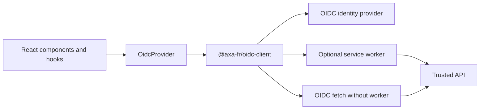

# @axa-fr/react-oidc

React components and hooks for OpenID Connect (OIDC), built on [`@axa-fr/oidc-client`](../oidc-client/README.md). The provider handles browser authentication callbacks, session restoration, and token renewal; your components use hooks to sign in, read user information, and call protected APIs.

The library supports Authorization Code Flow with PKCE, multiple named configurations, optional service-worker token isolation, PAR, and DPoP. It is a browser-side authentication library, not a server-side session or authorization system.

- [Quick start](#quick-start)
- [Protect components](#protect-components)
- [Call protected APIs](#call-protected-apis)
- [User information and token hooks](#user-information-and-token-hooks)
- [Service worker](#service-worker)
- [Configuration, renewal, PAR, and DPoP](#configuration-renewal-par-and-dpop)
- [Custom components and provider options](#custom-components-and-provider-options)
- [Routing and Next.js](#routing-and-nextjs)
- [Named configurations](#named-configurations)
- [Errors and missing providers](#errors-and-missing-providers)
- [Examples and further reading](#examples-and-further-reading)

<a id="getting-started"></a>

## Quick start

```sh
npm install @axa-fr/react-oidc
```

Register a public browser client with your identity provider using Authorization Code Flow with PKCE. Register the exact callback URL and post-logout URL, and allow the application's origin through CORS. Never embed a client secret in a browser application.

Replace the issuer and client ID below with your own settings. This example assumes a client-rendered React application with an HTML element named `root`. Your web server must serve the application on `/authentication/callback` as well as `/`.

```tsx
import { useState } from 'react';
import { createRoot } from 'react-dom/client';
import { OidcProvider, useOidc, type OidcConfiguration } from '@axa-fr/react-oidc';

const configuration: OidcConfiguration = {
  client_id: 'your-public-client',
  authority: 'https://issuer.example.com',
  redirect_uri: `${window.location.origin}/authentication/callback`,
  scope: 'openid profile',
};

function Account(): React.JSX.Element {
  const { login, logout, isAuthenticated } = useOidc();
  const [hasError, setHasError] = useState(false);

  const changeSession = async (): Promise<void> => {
    setHasError(false);
    try {
      if (isAuthenticated) {
        await logout('/');
      } else {
        await login('/');
      }
    } catch {
      setHasError(true);
    }
  };

  return (
    <main>
      <p>{isAuthenticated ? 'Signed in' : 'Not signed in'}</p>
      <button type="button" onClick={changeSession}>
        {isAuthenticated ? 'Sign out' : 'Sign in'}
      </button>
      {hasError && <p role="alert">Authentication failed. Please try again.</p>}
    </main>
  );
}

const root = document.getElementById('root');
if (!root) throw new Error('Missing root element');

createRoot(root).render(
  <OidcProvider configuration={configuration}>
    <Account />
  </OidcProvider>,
);
```

`OidcProvider` processes the callback route; do not call `loginCallbackAsync()` yourself inside this React setup. `login('/')` selects the application destination after authentication, not the registered callback URL.

This example uses browser storage. For optional token isolation, follow the [service-worker setup](#service-worker).



## Protect components

`OidcSecure` starts login when there is no authenticated session and renders its children only after authentication:

```tsx
import { OidcSecure } from '@axa-fr/react-oidc';

export function PrivatePage(): React.JSX.Element {
  return (
    <OidcSecure callbackPath="/account">
      <h1>Account</h1>
    </OidcSecure>
  );
}
```

Place it beneath `OidcProvider`. You can protect the whole application, a route element, or a smaller component. Optional props are `callbackPath`, authorization `extras`, and `configurationName`.

The higher-order component (HOC) equivalent is:

```tsx
import { withOidcSecure } from '@axa-fr/react-oidc';

function AccountDetails(): React.JSX.Element {
  return <h1>Account details</h1>;
}

export const ProtectedAccountDetails = withOidcSecure(AccountDetails, '/account');
```

Its signature is `withOidcSecure(Component, callbackPath?, extras?, configurationName?)`.

These components gate the UI; your APIs must independently validate tokens and enforce authorization.

## Call protected APIs

`useOidcFetch()` returns a fetch wrapper that attaches the access token (or a service-worker placeholder) and integrates with renewal. Use it only for trusted API URLs, not arbitrary user-supplied destinations.

```tsx
import { useState } from 'react';
import { useOidcFetch } from '@axa-fr/react-oidc';

export function ProfileRequest(): React.JSX.Element {
  const { fetch: oidcFetch } = useOidcFetch();
  const [status, setStatus] = useState('Ready');

  const loadProfile = async (): Promise<void> => {
    setStatus('Loading…');
    try {
      const response = await oidcFetch('https://api.example.com/profile');
      if (!response.ok) {
        throw new Error(`API request failed with status ${response.status}`);
      }
      setStatus('Profile request succeeded');
    } catch {
      setStatus('Could not load the profile');
    }
  };

  return (
    <>
      <button type="button" onClick={loadProfile}>
        Load profile
      </button>
      <p role="status">{status}</p>
    </>
  );
}
```

Render protected API consumers beneath `OidcSecure`, or wait until `useOidc().isAuthenticated` is true. Check `response.ok`: ordinary HTTP error responses do not automatically reject.

| API                                                                                     | Arguments / result                                                            |
| --------------------------------------------------------------------------------------- | ----------------------------------------------------------------------------- |
| `useOidcFetch(fetch?, configurationName?, demonstratingProofOfPossession?)`             | Returns `{ fetch }`; defaults to browser fetch and configuration `'default'`. |
| `withOidcFetch(fetch?, configurationName?, demonstratingProofOfPossession?)(Component)` | Injects a `fetch` prop into a component.                                      |

For example, `withOidcFetch()(ProfileComponent)` supplies the same wrapper through props instead of a hook.

## User information and token hooks

### User information

`useOidcUser()` reads the provider's user-info endpoint and exposes loading state. The exported enum is **`OidcUserStatus`**:

```tsx
import { OidcUserStatus, useOidcUser } from '@axa-fr/react-oidc';

export function UserGreeting(): React.JSX.Element {
  const { oidcUser, oidcUserLoadingState } = useOidcUser();

  switch (oidcUserLoadingState) {
    case OidcUserStatus.Loading:
      return <p>Loading profile…</p>;
    case OidcUserStatus.Unauthenticated:
      return <p>Please sign in.</p>;
    case OidcUserStatus.LoadingError:
      return <p>Could not load your profile.</p>;
    default:
      return <p>Hello, {oidcUser?.name ?? 'there'}.</p>;
  }
}
```

The hook also returns `reloadOidcUser()`. Use `useOidcUser<MyUserInfo>(configurationName?, demonstratingProofOfPossession?)` for custom claims, where `MyUserInfo` extends `OidcUserInfo`.

### Hook reference

| Hook                                                                  | Return values                                                                                            |
| --------------------------------------------------------------------- | -------------------------------------------------------------------------------------------------------- |
| `useOidc(configurationName?)`                                         | `isAuthenticated`, `login`, `logout`, `renewTokens`.                                                     |
| `useOidcUser<T>(configurationName?, demonstratingProofOfPossession?)` | `oidcUser`, `oidcUserLoadingState`, `reloadOidcUser`.                                                    |
| `useOidcAccessToken(configurationName?)`                              | `accessToken`, `accessTokenPayload`, and, when enabled, `generateDemonstrationOfProofOfPossessionAsync`. |
| `useOidcIdToken(configurationName?)`                                  | `idToken`, `idTokenPayload`.                                                                             |

`login(callbackPath?, extras?, silentLoginOnly?, scope?)`, `logout(callbackPath?, extras?)`, and `renewTokens(extras?)` return promises.

Prefer `useOidcFetch` over manually building authorization headers. When worker token hiding is enabled, `accessToken` is a placeholder rather than the real token. Do not render or log raw tokens, and treat user claims as personal data. An ID token identifies the user to the client; it is not a replacement for an API access token.

## Service worker

Ensure your application's static-assets directory exists (`public` below), then install the worker assets:

```sh
node ./node_modules/@axa-fr/react-oidc/bin/copy-service-worker-files.mjs public
```

Keep the generated `OidcServiceWorker.js` synchronized with package updates. For example, merge this into your application's `package.json`:

```json
{
  "scripts": {
    "postinstall": "node ./node_modules/@axa-fr/react-oidc/bin/copy-service-worker-files.mjs public"
  }
}
```

Then:

1. Configure `public/OidcTrustedDomains.js` with your provider and API destinations.
2. Add `service_worker_relative_url: '/OidcServiceWorker.js'` to the OIDC configuration.
3. Set `service_worker_only: true` if login must not fall back to browser token storage.
4. Serve the worker over HTTPS (or localhost) with a scope that covers the application.

Follow the [core service-worker guide](../oidc-client/README.md#service-worker) for a trusted-domain example, all options, token-exposure choices, and fallback behavior.

**Multi-tab login:** when `allowMultiTabLogin: true` is set in a trusted-domain entry, use `useOidcFetch()` or `withOidcFetch()` for protected API calls. Their tab-specific placeholder identifies the session to the worker. Plain fetch or a default Axios request cannot supply that marker and may result in HTTP 401.

The worker can hide access and refresh tokens from application JavaScript, but it does **not** prevent XSS or stop injected code from making requests through your application. It does not hide all identity information. Keep normal XSS defenses and avoid broad trusted-domain rules.

## Configuration, renewal, PAR, and DPoP

`OidcProvider` accepts the same `OidcConfiguration` as the vanilla client. Keep provider props, such as custom components and routing callbacks, outside that configuration object.

- **Configuration:** see the [core configuration reference](../oidc-client/README.md#configuration) for required fields, storage, discovery, timeouts, logout, and session monitoring.
- **Renewal:** automatic renewal is enabled by default. For `TokenAutomaticRenewMode.AutomaticOnlyWhenFetchExecuted`, use `useOidcFetch`/`withOidcFetch` so requests trigger renewal. See [renewal behavior and strict renewal](../oidc-client/README.md#token-renewal).
- **Silent login:** add a distinct `silent_redirect_uri` if required. The provider handles its silent-login routes. Provider and browser cookie policies can prevent iframe login.
- **PAR:** set `par: 'auto'` or `'required'` in `configuration`; the default is `'disabled'`. `auto` uses PAR when an endpoint is advertised; missing required endpoints fail before navigation. Once selected, PAR errors never silently downgrade. See [full PAR semantics, errors, and CORS requirements](../oidc-client/README.md#pushed-authorization-requests-par).
- **DPoP:** enable `demonstrating_proof_of_possession` and use `useOidcFetch(undefined, 'default', true)` or `withOidcFetch(undefined, 'default', true)`. For user info, use `useOidcUser('default', true)`. See [DPoP and worker-specific settings](../oidc-client/README.md#dpop). Both the identity provider and resource server must support it.

## Custom components and provider options

Replace built-in status screens with your own components. These are **provider props**, not fields inside `configuration`:

```tsx
const Loading = (): React.JSX.Element => <p>Restoring your session…</p>;
const AuthenticationError = (): React.JSX.Element => (
  <p role="alert">Sign-in failed. Please return to the sign-in page and try again.</p>
);

<OidcProvider
  configuration={configuration}
  loadingComponent={Loading}
  authenticatingErrorComponent={AuthenticationError}
>
  <App />
</OidcProvider>;
```

| Provider prop                                   | Purpose                                                                                                         |
| ----------------------------------------------- | --------------------------------------------------------------------------------------------------------------- |
| `configuration`, `configurationName`            | Client configuration and its name (`'default'` by default).                                                     |
| `loadingComponent`                              | Session restoration/loading screen.                                                                             |
| `loadingTimeoutComponent`                       | Screen shown when the loading watchdog expires.                                                                 |
| `authenticatingComponent`                       | Screen shown while starting login.                                                                              |
| `authenticatingErrorComponent`                  | Login or callback failure screen.                                                                               |
| `callbackSuccessComponent`                      | Screen shown after a successful callback.                                                                       |
| `sessionLostComponent`                          | Session-loss screen.                                                                                            |
| `serviceWorkerNotSupportedComponent`            | Unavailable-worker screen when worker-only mode is required.                                                    |
| `onSessionLost`                                 | Handles session loss instead of displaying the built-in session-loss flow.                                      |
| `onLogoutFromAnotherTab`, `onLogoutFromSameTab` | React to logout events.                                                                                         |
| `onEvent(configurationName, eventName, data)`   | Observe client events; avoid logging complete payloads.                                                         |
| `withCustomHistory`                             | Returns a history adapter with `replaceState(url, stateHistory?)`.                                              |
| `navigateAfterCallback(callbackPath)`           | Async callback to perform post-login navigation; takes precedence over the history adapter for this navigation. |
| `getFetch`                                      | Supplies a custom fetch implementation for the underlying client.                                               |
| `location`                                      | Custom `ILOidcLocation` adapter.                                                                                |

Custom status components receive `configurationName`. Set `configuration.loading_timeout_ms` to change the default 30-second loading watchdog, or a nonpositive value to disable it. See [`OidcProviderProps`](./src/OidcProvider.tsx) for the full type.

## Routing and Next.js

### Client-side routers

The default navigation uses the browser History API and dispatches `popstate`. Keep `OidcProvider` mounted on callback URLs. Protect route elements with `OidcSecure`; no particular router package is required.

For a router-specific integration, provide `navigateAfterCallback` to perform and await the router's navigation, or `withCustomHistory` to replace the default history adapter. These options belong on `OidcProvider`.

The library retains hash-route callback matching for legacy integrations, but OAuth redirect URIs must not contain a fragment. Prefer path-based callback URLs for new deployments, even if the rest of the application uses a hash router. Existing hash-callback setups depend on provider-specific behavior. Interactive and silent callback URLs must be different.

### Next.js

Keep this browser library behind a client-only boundary: do not access `window` or initialize the OIDC client while rendering on the server. In the App Router, `'use client'` alone does not disable prerendering; use an appropriate client-only mounting or dynamic-import strategy.

The repository's [Next.js demo](../../examples/nextjs-demo/README.md) uses the **Pages Router** and a custom history adapter. For an initialized client-only provider using `next/router`, a post-login navigation adapter can look like this:

```tsx
import { useRouter } from 'next/router';
import { OidcProvider } from '@axa-fr/react-oidc';

function ClientAuth({ children }: React.PropsWithChildren): React.JSX.Element {
  const router = useRouter();

  return (
    <OidcProvider
      configuration={configuration}
      navigateAfterCallback={async (path: string): Promise<void> => {
        await router.replace(path);
        window.dispatchEvent(new Event('popstate'));
      }}
    >
      {children}
    </OidcProvider>
  );
}
```

Here `configuration` is your browser-side OIDC configuration. Do not copy `next/router` into an App Router application; adapt to that router's APIs and navigation lifecycle. This package does not provide server-side route protection or a server session.

## Named configurations

Use names to separate identity providers or sessions with different scopes. Give each configuration distinct callback URLs and, for worker mode, a matching trusted-domain entry.

```tsx
<OidcProvider configuration={accountConfiguration}>
  <OidcProvider configuration={paymentsConfiguration} configurationName="payments">
    <App />
  </OidcProvider>
</OidcProvider>
```

Select the name explicitly; nesting does not change the hooks' default name:

```tsx
const { login, isAuthenticated } = useOidc('payments');
const { fetch: paymentsFetch } = useOidcFetch(undefined, 'payments');
```

Use `<OidcSecure configurationName="payments">` for that session's protected UI. Token and user hooks also accept a configuration name.

## Errors and missing providers

`OidcError`, `OidcErrorCode`, `isOidcError`, `OidcStateError`, `OidcStateErrorCode`, `isOidcStateError`, and the PAR error classes/guards are re-exported from this package. Use stable codes and phases, not string matching, for error handling.

See the [core errors and events guide](../oidc-client/README.md#errors-and-events) for renewal errors, missing/mismatched state, missing nonces, retryability, and recovery. The provider's custom error/session-loss screens and `onEvent` callback are the React integration points. For strict renewal outside a hook, use `OidcClient.getOrThrow(name).renewTokensOrThrowAsync()`.

When no client has been initialized for a name, `useOidc`, `useOidcUser`, `useOidcAccessToken`, and `useOidcIdToken` warn once per name and return unauthenticated/null defaults. This is useful in tests and Storybook, but does not initialize authentication.

`OidcClient.get(name)` returns `null` for a missing client; `getOrThrow(name)` fails explicitly. `OidcSecure` and requests made through `useOidcFetch` require initialization and remain fail-fast. Mount a matching provider before using them.

## Examples and further reading

- [React demo](../../examples/react-oidc-demo/README.md) — routes, hooks, worker options, and named configurations.
- [Next.js demo](../../examples/nextjs-demo/README.md) — Pages Router integration.
- [Core client guide and API](../oidc-client/README.md).
- [Service-worker protocol](../oidc-client-service-worker/PROTOCOL.md).
- [Service-worker package guide](../oidc-client-service-worker/README.md).
- [FAQ and deployment guidance](../../FAQ.md).

The demos use the repository's pnpm workspace. Follow their READMEs for setup rather than installing each package separately.
