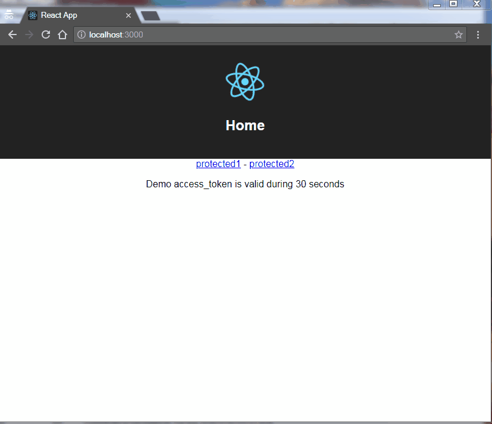
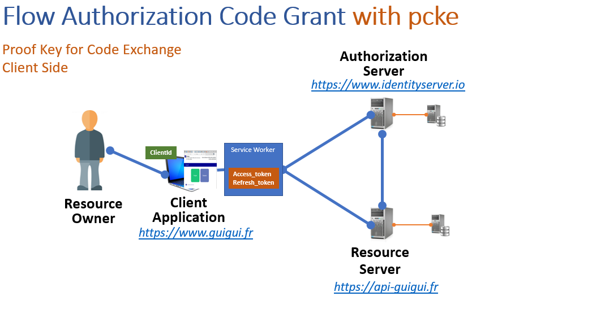

# @axa-fr/react-oidc

[](https://github.com/AxaGuilDEv/react-oidc/actions/workflows/npm-publish.yml)
[](https://sonarcloud.io/dashboard?id=AxaGuilDEv_react-oidc) [](https://sonarcloud.io/component_measures?id=AxaGuilDEv_react-oidc&metric=reliability_rating) [](https://sonarcloud.io/component_measures?id=AxaGuilDEv_react-oidc&metric=security_rating) [](https://sonarcloud.io/component_measures?id=AxaGuilDEv_react-oidc&metric=Coverage) [](https://twitter.com/intent/follow?screen_name=GuildDEvOpen)

Try the demo at https://black-rock-0dc6b0d03.1.azurestaticapps.net/

<p align="center">
    
</p>

<p align="center">
  A set of react components to make Oidc (OpenID Connect) client easy. It aim to simplify OAuth authentication between multiples providers.
</p>

- [About](#about)
- [Getting Started](#getting-started)
- [Run The Demo](#run-the-demo)
- [How It Works](#how-it-works)
- Packages
  - [`@axa-fr/react-oidc-context`](./packages/context#readme.md) [](https://badge.fury.io/js/%40axa-fr%2Freact-oidc-context)
  - [`@axa-fr/vanilla-oidc`](./packages/vanilla#readme.md) [](https://badge.fury.io/js/%40axa-fr%2Fvanilla-oidc)
  - [`@axa-fr/react-oidc-context-fetch`](./packages/context-fetch#readme.md) [](https://badge.fury.io/js/%40axa-fr%2Freact-oidc-context-fetch) **Deprecated in v4**
  - [`@axa-fr/react-oidc-redux`](./packages/redux#readme.md) [](https://badge.fury.io/js/%40axa-fr%2Freact-oidc-redux) **Deprecated in v4 : use react-oidc-context which works with redux and in fact does not use any react context**
  - [`@axa-fr/react-oidc-redux-fetch`](./packages/redux-fetch#readme.md) [](https://badge.fury.io/js/%40axa-fr%2Freact-oidc-redux-fetch) **Deprecated in v4**
  - [`@axa-fr/react-oidc-fetch-observable`](./packages/fetch-observable#readme.md) [](https://badge.fury.io/js/%40axa-fr%2Freact-oidc-fetch-observable) **Deprecated in v4**
- [Contribute](#contribute)

## About

These libraries is used to manage client authentication.

V4 is a complete rewrite. It uses the libraries ["App-AuthJS"](https://github.com/openid/AppAuth-JS) instead of oidc-client.
In the v4 we have chosen to remove a lot the surface API in order to simplify usage and enforce security.
In this version you can use a ServiceWorker that will hide the refresh_token and access_token (more secure).

For migrating from v3 to v4 checkout our [`migration guide v3 to v4`](./MIGRATION_GUIDE_V3_TO_V4.md)

- **Secure** :
  - With the use of Service Worker, your tokens (refresh_token and access_token) are not accessible to the javascript client code (big protection against XSRF attacks)
  - OIDC using client side Code Credential Grant with pkce only
- **Simple** :
  - refresh_token and access_token are auto refreshed in background
  - with the use of the Service Worker, you do not need to inject the access_token in every fetch, you have only to configure OidcTrustedDomains.js file
- **No cookies problem** : No silent signin mode inside in iframe
- **Multiple Authentification** :
  - You can authenticate many times to the same provider with different scope (for exemple you can acquire a new 'payment' scope for a payment)
  - You can authenticate to multiple different providers inside the same SPA (single page application) website
- **Flexible** :
  - Work with Service Worker (more secure) and whithout for older browser (less secure)

<p align="center">
    
  <br>
  The service worker catch <b>access_token</b> and <b>refresh_token</b> that will never be accessible to the client.
</p>

## Getting Started

### Getting Started React using create-react-app
```sh
npm install @axa-fr/react-oidc-context copyfiles --save
```

If you need a very secure mode where refresh_token and access_token will be hide behind a service worker that will proxify requests.

Add a copy task in order to install and stay up to date an Oidc Service Worker.
The only file you should edit is "OidcTrustedDomains.js" which will never be erased with the configuration bellow.

```sh
#package.json
{
    "scripts": {
        "copy": "copyfiles -f ./node_modules/@axa-fr/react-oidc-context/dist/OidcServiceWorker.js ./public && copyfiles -f -s ./node_modules/@axa-fr/react-oidc-context/dist/OidcTrustedDomains.js ./public && copyfiles -f ./node_modules/@axa-fr/react-oidc-context/dist/OidcKeepAliveServiceWorker.json ./public",
        "start:server": "react-scripts start",
        "build:server": "npm run copy && react-scripts build",
        "prepare": "npm run copy"
    }
}
```

```javascript
import React from 'react';
import { render } from 'react-dom';
import { BrowserRouter as Router } from 'react-router-dom';
import { OidcProvider } from '@axa-fr/react-oidc-context';
import Header from './Layout/Header';
import Routes from './Router';

// This configuration use the ServiceWorker mode only
// "access_token" will be provided automaticaly to the urls and domains configured inside "OidcTrustedDomains.js"
const configuration = {
  client_id: 'interactive.public.short',
  redirect_uri: 'http://localhost:4200/authentication/callback',
  scope: 'openid profile email api offline_access',
  authority: 'https://demo.identityserver.io',
  service_worker_relative_url:'/OidcServiceWorker.js',
  service_worker_only:true,
};

const App = () => (
    <OidcProvider configuration={configuration} >
      <Router>
        <Header />
        <Routes />
      </Router>
    </OidcProvider>
);

render(<App />, document.getElementById('root'));
```

```javascript
// OidcTrustedDomains.js
// Add here trusted domains, access tokens will be send
const trustedDomains = {
    default:["http://localhost:4200"],
    auth0:[]
};
```

"OidcSecure" component trigger authentication in case user is not authenticated. So, the children of that component can be accessible only once you are connected.

```javascript
import React from 'react';
import { OidcSecure } from '@axa-fr/react-oidc-context';

const AdminSecure = () => (
  <OidcSecure>
    <h1>My sub component</h1>}
  </OidcSecure>
);

export default AdminSecure;
```

How to get IDToken

```javascript
import { useOidcIdToken } from '@axa-fr/react-oidc-context';

const DisplayIdToken =() => {
    const{ idToken, idTokenPayload } = useOidcIdToken();

    if(!idToken){
        return <p>you are not authentified</p>
    }
    
    return (
        <div className="card text-white bg-info mb-3">
            <div className="card-body">
                <h5 className="card-title">ID Token</h5>
                {idToken != null && <p className="card-text">{JSON.stringify(idToken)}</p>}
                {idTokenPayload != null && <p className="card-text">{JSON.stringify(idTokenPayload)}</p>}
            </div>
        </div>
    );
}

```

How to get User Information

```javascript
import { useOidcUser } from '@axa-fr/react-oidc-context';

const DisplayUserInfo = () => {
    const{ oidcUser, isOidcUserLoading, isLogged } = useOidcUser();

    if(isOidcUserLoading) {
        return <p>User Information are loading</p>
    }

    if(!isLogged){
        return <p>you are not authentified</p>
    }

    return (
        <div className="card text-white bg-success mb-3">
            <div className="card-body">
                <h5 className="card-title">User information</h5>
                {oidcUser != null && <p className="card-text">{JSON.stringify(oidcUser)}</p>}
            </div>
        </div>
    )
};
```


More documentation :
- [`@axa-fr/react-oidc-context`](./packages/context#readme)

### Getting Started Vanilla

More documentation :
- [`@axa-fr/vanilla-oidc`](./packages/vanilla#readme)

## Run The Demo

```sh
git clone https://github.com/AxaGuilDEv/react-oidc.git
cd react-oidc/packages/context
npm install
npm start
# then navigate to http://localhost:4200
```

## How It Works

These components encapsulate the use of "AppAuth-JS" in order to hide workfow complexity.
Internally, native History API is used to be router library agnostic.

## Contribute

- [How to run the solution and to contribute](./CONTRIBUTING.md)
- [Please respect our code of conduct](./CODE_OF_CONDUCT.md)
