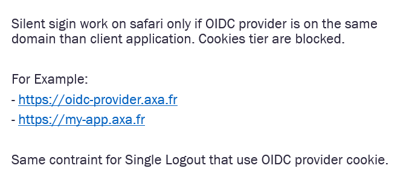

# @axa-fr/react-oidc

[](https://github.com/AxaGuilDEv/react-oidc/actions/workflows/npm-publish.yml)
[](https://sonarcloud.io/dashboard?id=AxaGuilDEv_react-oidc) [](https://sonarcloud.io/component_measures?id=AxaGuilDEv_react-oidc&metric=reliability_rating) [](https://sonarcloud.io/component_measures?id=AxaGuilDEv_react-oidc&metric=security_rating) [](https://sonarcloud.io/component_measures?id=AxaGuilDEv_react-oidc&metric=Coverage) [](https://twitter.com/intent/follow?screen_name=GuildDEvOpen)

Try the demo at https://black-rock-0dc6b0d03.1.azurestaticapps.net/

<p align="center">
    
</p>

<p align="center">
  A set of react components to make Oidc (OpenID Connect) client easy. It aim to simplify OAuth authentication between multiples providers. It is compatible with NextJS.
</p>

- [About](#about)
- [Getting Started](#getting-started)
- [Run The Demo](#run-the-demo)
- [Run The Nextjs Demo](#run-the-nextjs-demo)
- [How It Works](#how-it-works)
- Packages
  - [`@axa-fr/react-oidc`](./packages/react#readme.md) [](https://badge.fury.io/js/%40axa-fr%2Freact-oidc)
  - [`@axa-fr/vanilla-oidc`](./packages/vanilla#readme.md) [](https://badge.fury.io/js/%40axa-fr%2Fvanilla-oidc)
  - [`@axa-fr/react-oidc-context`](./packages/context#readme.md) [](https://badge.fury.io/js/%40axa-fr%2Freact-oidc-context) **Will be deprecated in v6: has been renamed to @axa-fr/react-oidc**
  - [`@axa-fr/react-oidc-context-fetch`](./packages/context-fetch#readme.md) [](https://badge.fury.io/js/%40axa-fr%2Freact-oidc-context-fetch) **Deprecated in v4**
  - [`@axa-fr/react-oidc-redux`](./packages/redux#readme.md) [](https://badge.fury.io/js/%40axa-fr%2Freact-oidc-redux) **Deprecated in v4 : use react-oidc-context which works with redux and in fact does not use any react context**
  - [`@axa-fr/react-oidc-redux-fetch`](./packages/redux-fetch#readme.md) [](https://badge.fury.io/js/%40axa-fr%2Freact-oidc-redux-fetch) **Deprecated in v4**
  - [`@axa-fr/react-oidc-fetch-observable`](./packages/fetch-observable#readme.md) [](https://badge.fury.io/js/%40axa-fr%2Freact-oidc-fetch-observable) **Deprecated in v4**
- [Migrations](#migrations)
- [Contribute](#contribute)

## About

These libraries is used to manage client authentication.

- **Secure** :
  - With the use of Service Worker, your tokens (refresh_token and access_token) are not accessible to the javascript client code (big protection against XSRF attacks)
  - OIDC using client side Code Credential Grant with pkce only
- **Lightweight** 
- **Simple** :
  - refresh_token and access_token are auto refreshed in background
  - with the use of the Service Worker, you do not need to inject the access_token in every fetch, you have only to configure OidcTrustedDomains.js file
- **No cookies problem** : You can disable silent signin (that internally use an iframe). For your information, your OIDC server should be in the same domain of your website in order to be able to send OIDC server cookies from your website via an internal IFRAME, else, you may encounter COOKIES problem.
- **Multiple Authentication** :
  - You can authenticate many times to the same provider with different scope (for example you can acquire a new 'payment' scope for a payment)
  - You can authenticate to multiple different providers inside the same SPA (single page application) website
- **Flexible** :
  - Work with Service Worker (more secure) and without for older browser (less secure)

<p align="center">
    
  <br>
  The service worker catch <b>access_token</b> and <b>refresh_token</b> that will never be accessible to the client.
</p>

Work perfectly well with :
- [auth0](https://auth0.com/)
- [identity server](https://duendesoftware.com/)
- google
- aws
- [keycloak](https://www.keycloak.org/)
- all oidc compatible providers

<p align="center">
    
  <br>
  @axa-fr/react-oidc is one of the securest way to Authenticate. 
</p>

<p align="center">
    
  <br>
  Service Worker lifetime drawback. 
</p>

<p align="center">
    
  <br>
  Silent-Signing constraints. 
</p>

<p align="center">
    
  <br>
  @axa-fr/react-oidc is the simpliest and cheapest. 
</p>


## Getting Started

### Getting Started React using create-react-app

```sh
npm install @axa-fr/react-oidc --save

# If you have a "public" folder, the 2 files will be created :
# ./public/OidcServiceWorker.js <-- will be updated at each "npm install"
# ./public/OidcTrustedDomains.js <-- won't be updated if already exist
```

If you need a very secure mode where refresh_token and access_token will be hide behind a service worker that will proxify requests.
The only file you should edit is "OidcTrustedDomains.js".

```javascript
import React from 'react';
import { render } from 'react-dom';
import { BrowserRouter as Router } from 'react-router-dom';
import { OidcProvider } from '@axa-fr/react-oidc';
import Header from './Layout/Header';
import Routes from './Router';

// This configuration use the ServiceWorker mode only
// "access_token" will be provided automaticaly to the urls and domains configured inside "OidcTrustedDomains.js"
const configuration = {
  client_id: 'interactive.public.short',
  redirect_uri: window.location.origin + '/authentication/callback',
  silent_redirect_uri: window.location.origin + '/authentication/silent-callback', // Optional activate silent-signin that use cookies between OIDC server and client javascript to restore the session
  scope: 'openid profile email api offline_access',
  authority: 'https://demo.duendesoftware.com',
  service_worker_relative_url:'/OidcServiceWorker.js',
  service_worker_only:true,
};

const App = () => (
    <OidcProvider configuration={configuration} >
      <Router>
        <Header />
        <Routes />
      </Router>
    </OidcProvider>
);

render(<App />, document.getElementById('root'));
```

```javascript
// OidcTrustedDomains.js

// Add bellow trusted domains, access tokens will automatically injected to be send to
// trusted domain can also be a path like https://www.myapi.com/users, 
// then all subroute like https://www.myapi.com/useers/1 will be authorized to send access_token to.

// Domains used by OIDC server must be also declared here
const trustedDomains = {
  default:["https://demo.duendesoftware.com", "https://www.myapi.com/users"]
};
```

How to consume

"useOidc" returns all props from the Hook :

```javascript
import React from 'react';
import {useOidc} from "./oidc";

export const Home = () => {

    const { login, logout, isAuthenticated} = useOidc();
    
    return (
        <div className="container-fluid mt-3">
            <div className="card">
                <div className="card-body">
                    <h5 className="card-title">Welcome !!!</h5>
                    <p className="card-text">React Demo Application protected by OpenId Connect</p>
                    {!isAuthenticated && <button type="button" className="btn btn-primary" onClick={() => login('/profile')}>Login</button>}
                    {isAuthenticated && <button type="button" className="btn btn-primary" onClick={() => logout()}>logout</button>}
                </div>
            </div>
        </div>
    )
};

```
The Hook method exposes :
- isAuthenticated : if the user is logged in or not
- logout: logout function (return a promise)
- login: login function 'return a promise'

"OidcSecure" component trigger authentication in case user is not authenticated. So, the children of that component can be accessible only once you are connected.

```javascript
import React from 'react';
import { OidcSecure } from '@axa-fr/react-oidc';

const AdminSecure = () => (
  <OidcSecure>
    <h1>My sub component</h1>}
  </OidcSecure>
);

export default AdminSecure;
```

How to get IDToken

```javascript
import { useOidcIdToken } from '@axa-fr/react-oidc';

const DisplayIdToken =() => {
    const{ idToken, idTokenPayload } = useOidcIdToken();

    if(!idToken){
        return <p>you are not authentified</p>
    }
    
    return (
        <div className="card text-white bg-info mb-3">
            <div className="card-body">
                <h5 className="card-title">ID Token</h5>
                {<p className="card-text">{JSON.stringify(idToken)}</p>}
                {idTokenPayload != null && <p className="card-text">{JSON.stringify(idTokenPayload)}</p>}
            </div>
        </div>
    );
}

```

How to get User Information

```javascript
import {useOidcUser} from '@axa-fr/react-oidc';

const DisplayUserInfo = () => {
  const {oidcUser, oidcUserLoadingState} = useOidcUser();

  switch (oidcUserLoadingState) {
    case OidcUserStatus.Loading:
      return <p>User Information are loading</p>;
    case OidcUserStatus.Unauthenticated:
      return <p>you are not authenticated</p>;
    case OidcUserStatus.LoadingError:
      return <p>Fail to load user information</p>;
    default:
      return (
              <div className="card text-white bg-success mb-3">
                <div className="card-body">
                  <h5 className="card-title">User information</h5>
                  <p className="card-text">{JSON.stringify(oidcUser)}</p>
                </div>
              </div>
      );
  }
};

```

More documentation :
- [`@axa-fr/react-oidc`](./packages/react#readme)

### Getting Started Vanilla

More documentation :
- [`@axa-fr/vanilla-oidc`](./packages/vanilla#readme)

## Run The Demo

```sh
git clone https://github.com/AxaGuilDEv/react-oidc.git
cd react-oidc/packages/react
npm install
npm start
# then navigate to http://localhost:4200
```

## Run The NextJS Demo

```sh
git clone https://github.com/AxaGuilDEv/react-oidc.git
cd react-oidc/packages/nextjs-demo
npm install
npm run dev
# then navigate to http://localhost:3001
```

## How It Works

These components encapsulate the use of "AppAuth-JS" in order to hide workflow complexity.
Internally, native History API is used to be router library agnostic.

More information about OIDC
- French: https://medium.com/just-tech-it-now/augmentez-la-s%C3%A9curit%C3%A9-et-la-simplicit%C3%A9-de-votre-syst%C3%A8me-dinformation-avec-oauth-2-0-cf0732d71284 
- English: https://medium.com/just-tech-it-now/increase-the-security-and-simplicity-of-your-information-system-with-openid-connect-fa8c26b99d6d

## Migrations

V4 is a complete rewrite. It uses the libraries ["App-AuthJS"](https://github.com/openid/AppAuth-JS) instead of oidc-client.
In the v4 we have chosen to remove a lot the surface API in order to simplify usage and enforce security.
In this version you can use a ServiceWorker that will hide the refresh_token and access_token (more secure).

- For migrating from v3 to v4 checkout our [`migration guide v3 to v4`](./MIGRATION_GUIDE_V3_TO_V4.md)
- For migrating from v3 to v5 checkout our [`migration guide v3 to v5`](./MIGRATION_GUIDE_V3_TO_V5.md)
- For migrating from v4 to v5 checkout our [`migration guide v4 to v5`](./MIGRATION_GUIDE_V4_TO_V5.md)
- For migrating from v5 to v6 checkout our [`migration guide v5 to v6`](./MIGRATION_GUIDE_V5_TO_V6.md)

## Contribute

- [How to run the solution and to contribute](./CONTRIBUTING.md)
- [Please respect our code of conduct](./CODE_OF_CONDUCT.md)
